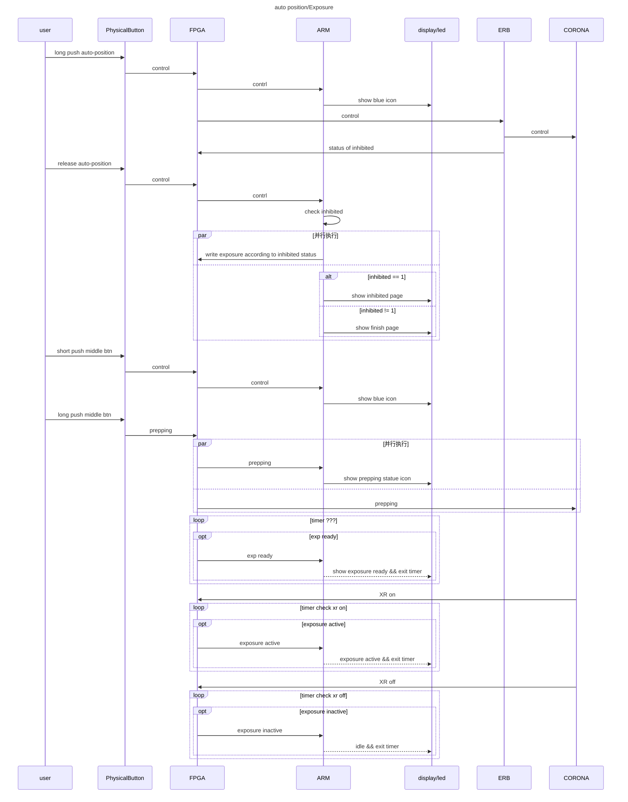
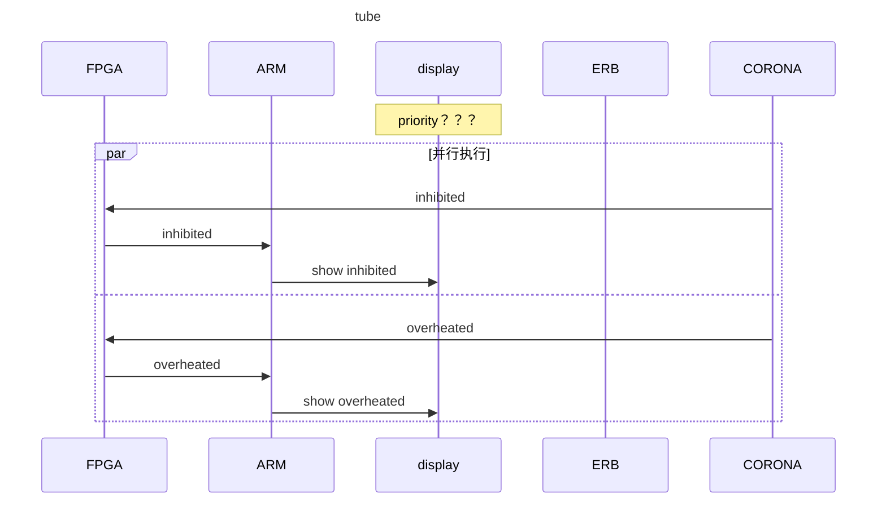
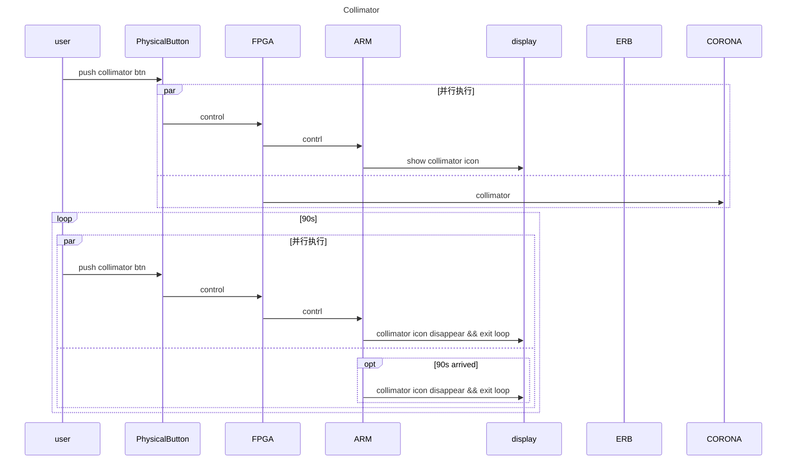
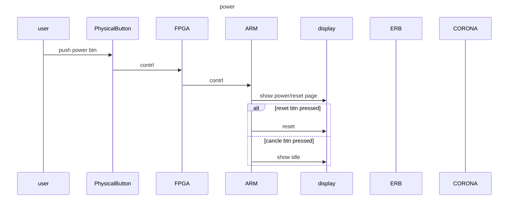
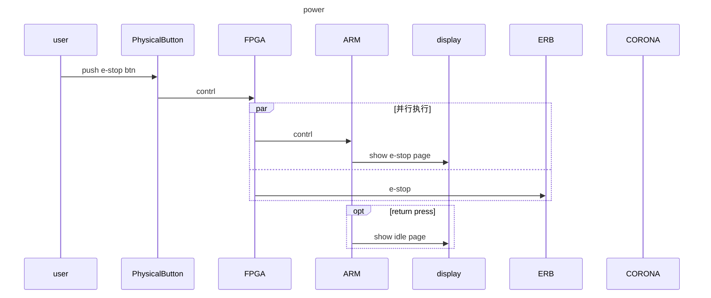
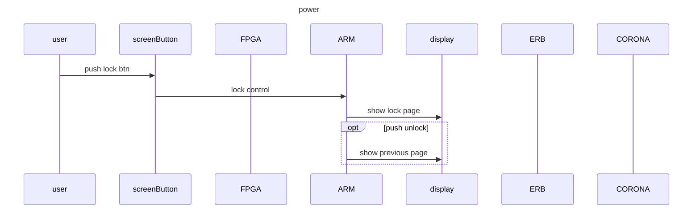
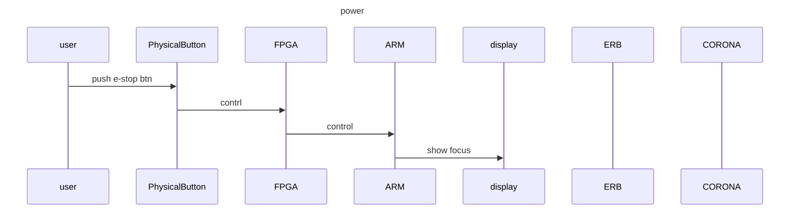

# 1,AutoPosition / Exposure

``` mermaid
sequenceDiagram
		title: auto position/Exposure
    participant user
    participant button as PhysicalButton
    participant fpga as FPGA
    participant arm  as ARM
    participant display as display/led
    participant erb as ERB
    participant corona as CORONA
    
    user ->> button: long push auto-position
    button ->> fpga: control
    fpga ->> arm: contrl
    arm ->> display: show blue icon
    fpga ->> erb: control
    erb ->> corona: control
    erb ->> fpga: status of inhibited
    user ->> button: release auto-position
    button ->> fpga: control
    fpga ->> arm: contrl
    arm ->> arm: check inhibited
    
    par 并行执行
		    arm ->> fpga: write exposure according to inhibited status
    and
		    alt inhibited == 1
            arm ->> display : show inhibited page
        else  inhibited != 1
            arm ->> display : show finish page
        end
    end
    
    user ->> button: short push middle btn
    button ->> fpga: control
    fpga ->> arm: control
    arm ->> display: show blue icon
    
    
    user ->> button: long push middle btn
    button ->> fpga: prepping
    
    par 并行执行
				fpga ->> arm: prepping
				arm ->> display: show prepping statue icon
    and
    		fpga ->> corona: prepping
    end
    
   loop timer ???
        
        opt exp ready
		        fpga ->> arm : exp ready
        		arm -->> display : show exposure ready && exit timer
        end
    end
    
    corona ->> fpga: XR on
    
		loop timer  check xr on        
        opt exposure active
		        fpga ->> arm : exposure active 
        		arm -->> display : exposure active && exit timer
        end
    end
    
    corona ->> fpga: XR off
    
		loop timer  check xr off        
        opt exposure inactive
		        fpga ->> arm : exposure inactive 
        		arm -->> display : idle && exit timer
        end
    end
```

# 2,Tube 

```mermaid
sequenceDiagram
		title: tube
    participant fpga as FPGA
    participant arm  as ARM
    participant display as display
    participant erb as ERB
    participant corona as CORONA
    
    Note over display : priority？？？
    par 并行执行
		       corona ->> fpga :inhibited
		       fpga ->> arm :inhibited
		       arm ->> display: show inhibited
    and
   			 corona ->> fpga :overheated 
   			 fpga ->> arm :overheated
   			 arm ->> display: show overheated
    end


```

# 3,Collimator

``` mermaid
sequenceDiagram
		title: Collimator
		participant user
    participant button as PhysicalButton
    participant fpga as FPGA
    participant arm  as ARM
    participant display as display
    participant erb as ERB
    participant corona as CORONA
    
    user ->> button: push collimator btn
    
    par 并行执行
         button ->> fpga: control
         fpga ->> arm: contrl
         arm ->> display: show collimator icon
    and
   			 fpga ->> corona :collimator 
    end
    

    
    loop 90s
      par 并行执行
		      user ->> button: push collimator btn
          button ->> fpga: control
          fpga ->> arm: contrl
          arm ->> display:  collimator icon disappear && exit loop
      and
          opt 90s arrived
              arm ->> display:  collimator icon disappear && exit loop
          end
    end
    end
```

# 4,power 

## power off 不要了

``` mermaid
sequenceDiagram
		title: power 
		participant user
    participant button as PhysicalButton
    participant fpga as FPGA
    participant arm  as ARM
    participant display as display
    participant erb as ERB
    participant corona as CORONA

	
	 	user ->> button: push power btn
	 	button ->> fpga: contrl
    fpga ->> arm: contrl
    arm ->> display: show power/reset page    

    alt reset btn pressed
        arm ->> display:  reset
    else cancle btn pressed
        arm ->> display: show idle
    end


```

# 5,e-stop

``` mermaid
sequenceDiagram
		title: power 
		participant user
    participant button as PhysicalButton
    participant fpga as FPGA
    participant arm  as ARM
    participant display as display
    participant erb as ERB
    participant corona as CORONA

	
	 	user ->> button: push e-stop btn
	 	button ->> fpga: contrl
	 	par 并行执行
          fpga ->> arm: contrl
    			arm ->> display: show e-stop page
    and
        fpga ->> erb : e-stop
    end
     

    opt return press
        arm ->> display:  show idle page
    end


```

# 6, lock

``` mermaid
sequenceDiagram
		title: power 
		participant user
		participant button as screenButton  
		participant fpga as FPGA
    participant arm  as ARM
    participant display as display
    participant erb as ERB
    participant corona as CORONA

		user ->> button: push lock btn
		button ->> arm: lock control
		arm ->> display: show lock page
    opt push unlock
        arm ->> display: show previous page
    end


```

# 7,push to talk

```mermaid
sequenceDiagram
		title: power 
		participant user
    participant button as PhysicalButton
    participant fpga as FPGA
    participant arm  as ARM
    participant display as display
    participant erb as ERB
    participant corona as CORONA

	
	 	user ->> button: push e-stop btn
	 	button ->> fpga: contrl
	 	fpga ->> arm: control
	 	arm ->> display: show focus


```

